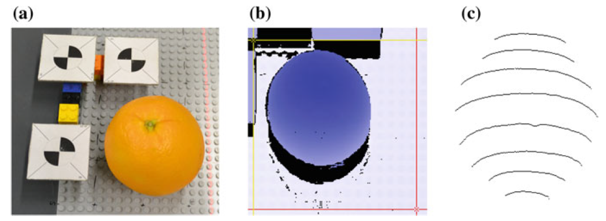

# Stripe Matching

Implementation of our paper entitled Stripes-Based Object Matching

omputer and Information Science, volume 656, 2016, pp 59-72.

paper: https://link.springer.com/chapter/10.1007/978-3-319-40171-3_5

## Citation

If you benefit from this work, please cite the mentioned and our paper:

	@article{yang2016stripe,
		author = {Tiebe, Oliver and Yang, Cong and Khan, Muhammad Hassan and Grzegorzek, Marcin and Scarpin, Dominik},
		title = {Stripes-based object matching},
		journal = {Computer and Information Science},
            pages = {59-72},
            year = {2016},
            publisher={Springer}
	}
